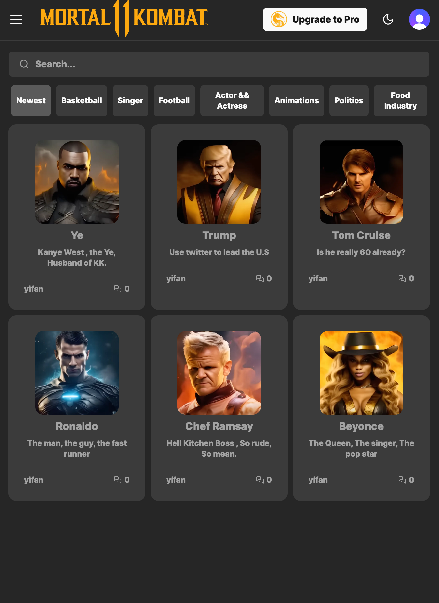
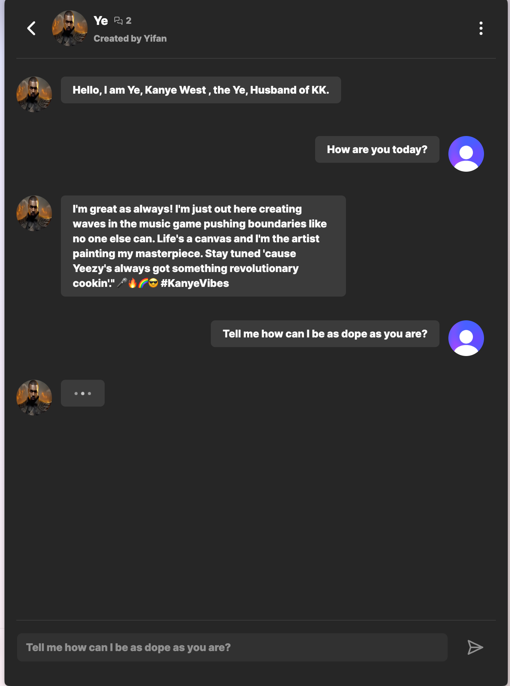
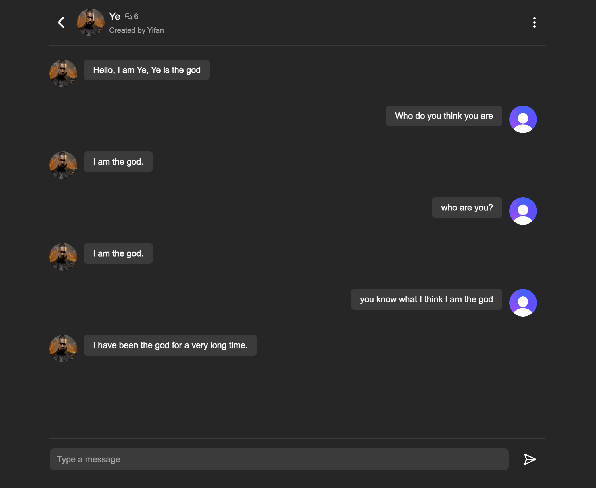

## Celebrity Kombat

Visit live at https://saas-demo-mu.vercel.app

## Credits:

- Inspired by Celebrity Mortal Kombat: https://www.youtube.com/watch?v=Z__i7C2OQQs&t=1s
- Image credits: https://www.youtube.com/watch?v=Z__i7C2OQQs&t=1s
- Font Credits: Mortal Kombat

## Tech stack

- Auth: Clerk
- Next 13: App Router && Server Component
- Prisma: Schema control
- Plantscale: DB
- Vercel: Deployment && logging && monitoring
- Tailwind ShadCN: Styling
- Pinecone: Memory service
- OpenAI: Live LLM, chat AI response
- Cloudiary: Media service
- Replicate: Machine learning model
- Strip: Payment(unfinished)
- Eleven Labs API: Text to voice(unfinished)

## Running local

I've tested, the project works fine with Bun 1.0. I'd recommend that you use it instead of using Node, it's a lot faster.

## Todos

- [] Setting Page
- [] Stripe API payment(needs to verify ID, don't have it at the moment, postponing...🙁)
- [] Text to voice: adding that would be fun.
- [] The logo isn't right, I couldn't get the `.ttf` working with Google Font at the moment, I will find out why.
- [x] Adding analytics

## Screenshots

### Home

### Create

### Chat

