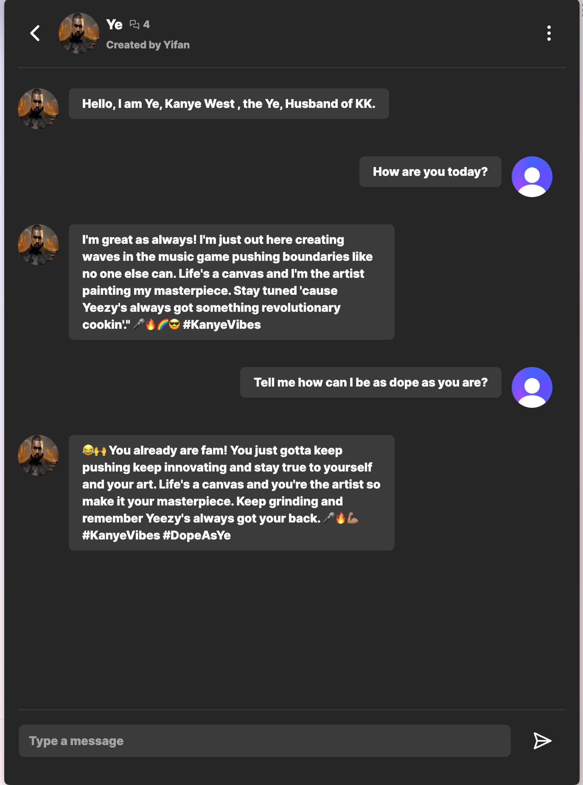

Visit live at https://saas-demo-mu.vercel.app

## Celebrity Kombat

* Inspired by Celebrity Mortal Kombat: https://www.youtube.com/watch?v=Z__i7C2OQQs&t=1s
* Image credits: https://www.youtube.com/watch?v=Z__i7C2OQQs&t=1s

## Tech stack
* Auth, Clerk 
* Next 13, App Router 
* Prisma, schema control
* Plantscale, DB
* Vercel, Deployment
* Tailwind shadCN, styling 
* Pinecone, Memory Service
* OpenAI, Chat AI response
* Cloudiary, media service
* Strip, Payment(unfinished)

## Home 

## Create

## Chat 

## Run local
The project works fine with Bun 1.0, using Bun command instead of Node, it's a lot more faster. 